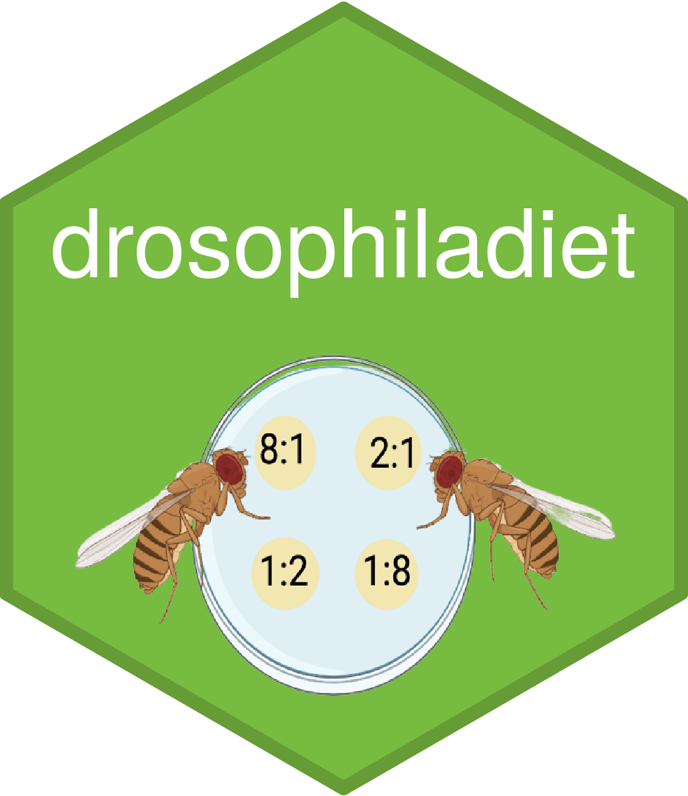
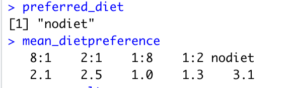
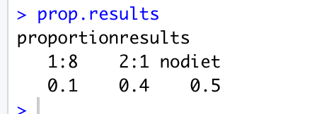
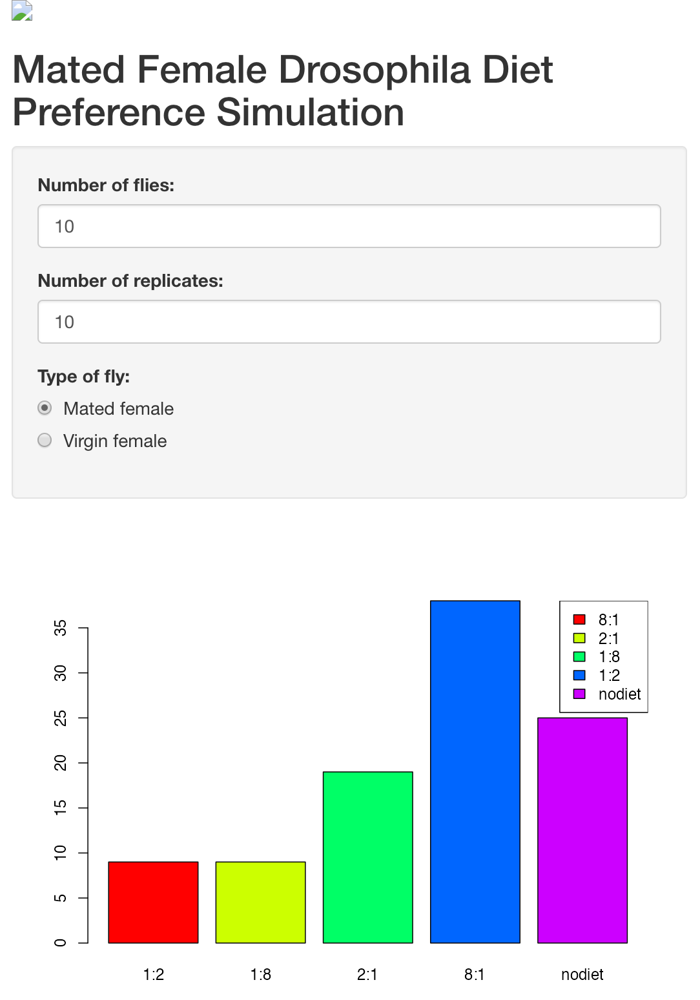

# *Drosophila Melanogaster* diet simulation

# drosophiladiet 
 
 
A simulation for a preferred diet over a choice of four varying protein: carbohydrate ratios for different types of *drosophila melanogaster*.  

 

This simulation gives the mean average of how many flies prefer a particular diet over a series of repeat experiments and the preferred diet choice for: 

1. Mated female diet preference
2. Virgin female diet preference 

Over a choice of diets: 

__8:1, 2:1, 1:2, 1:8__ and the choice of __no diet__ (around the assay plate)

### Coded simulation giving mean and proportional values

This repository contains code which will give the mean average of a choice of 10 flies, across 10 replicates as well as what is the preferred diet choice. 
This also contains code which will give a proportional value of the diet in which flies will go to when given the choice. 

 

### *Drosophila* Diet Preference Shiny Simulation 

Also contains an __R Shiny__ simulation in which you can select the amount of flies and amount of replicate diet assay plates and will give you the amount of flies on each diet depending. 

